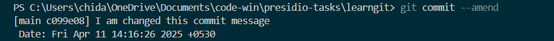
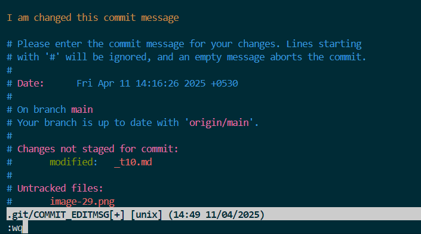
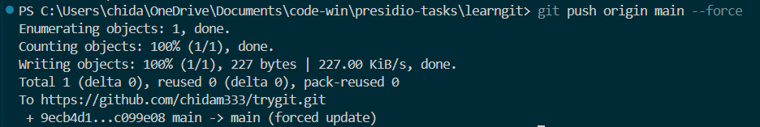
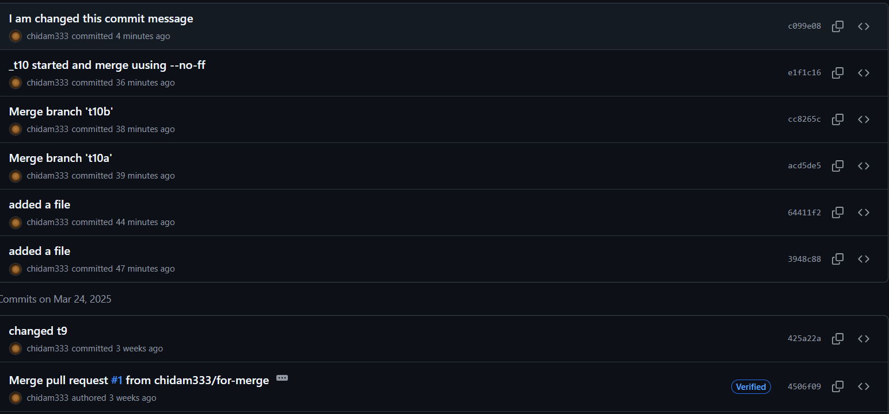
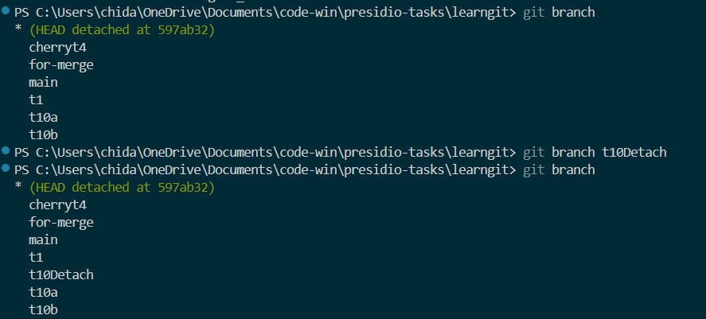

# creating 2 branch t10a & t10b

# They are ahead by 1 unique file each. 

# Using of --no-ff to preserve merge history

# Existing Commit History

# Using amend flag to change the commit message

# Changing commit msg

# Forcefully pushing the changes

# Updated commit history

# Creating a branch for the detached head

