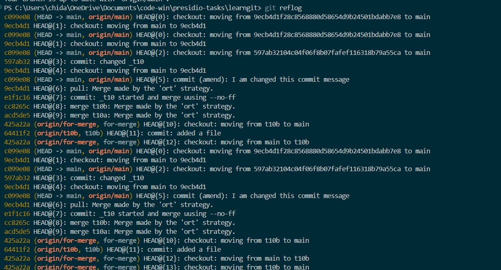

# creating 2 branch t10a & t10b

# They are ahead by 1 unique file each. 

# Using of --no-ff to preserve merge history

# Existing Commit History

# Using amend flag to change the commit message :( image deleted due to all this gitery

# Changing commit msg :( image deleted due to all this gittery

# Forcefully pushing the changes :( image deleted due to all this gittery

# Updated commit history :( image deleted due to all the gittery

# git reflog

