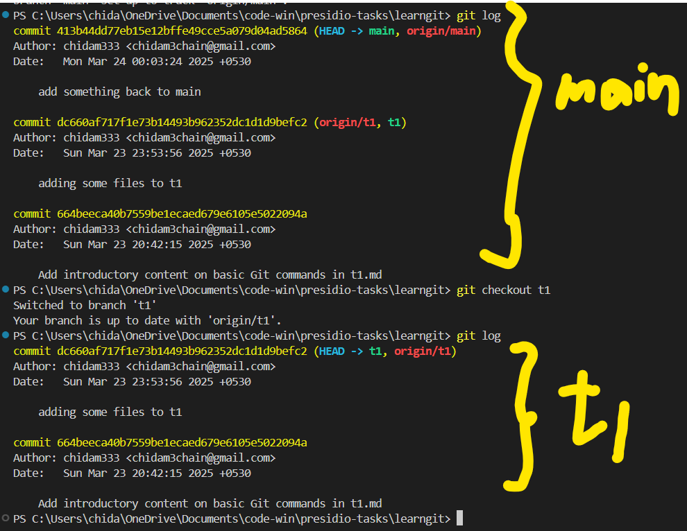

- git init, git add, and git commit are extremely simple command to initialize a repo, stage changes and commit the changes
- i create some changes in a new branch t1

# initial command

# Creating a new branch t1 and adding few files to it 

# Comparing the commit histroy of 2 different branches 

