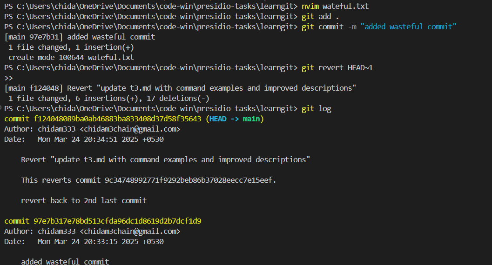

# Commands used

```
git add
git status
git restore
git revert
```


# Make changes


# Stage the changes (add .)


# check status


# now restore all stagged files


# check status again


# Git revert 

