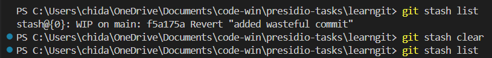
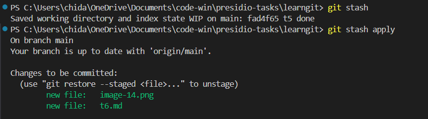

# commands i played around with 

```
git stash
git stash list
git stash pop
git stash show
git stash drop
git stash apply
```
# Removing existing stashes



# Add this changes -> then stash this changes -> then apply the stash




also checked out pop, show, drop